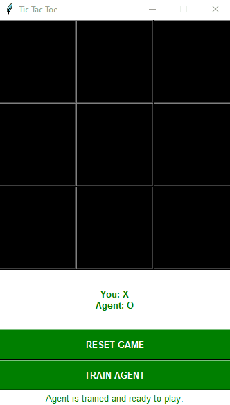

# 🤖 TicTacToe agent based on Reinforcement leaning

This project was made as a part of the _Intelligent Systems_ course at _Faculty of Organization and Informatics_. 

## 🥅 Project goals

The goal of this project was simple - to make agent learn to play the Tic-tac-toe game!

## 📜 Docs

Run the code

    python main.py

### The Rules

Following statements are true:

- Human player always plays as 'X' therefore always plays first.
- Game is over when one of the players gets 3 pic.... oh you know the rules..

### The training

Project supports agent training, code can be found in [train.py](https://github.com/marzekan/tictactoe-rl-agent/blob/main/train.py) file. 

Agent training is achieved by placing 2 agent.py agents against one another for some number of iterations.
For now the number of iterations is hardcoded on this [line](https://github.com/marzekan/tictactoe-rl-agent/blob/7e633b794ba5b0bbe9c42f993522326728ff4d4d/main.py#L152):

    numberOfIterations = 200000

This, of course, is to be changed at some point in the future...

## 🔗 Credits

This project was greatly inspired by the following sources:

[[1] How to use reinforcement learning to play tic-tac-toe](https://towardsdatascience.com/how-to-play-tic-tac-toe-using-reinforcement-learning-9604130e56f6) by Rickard Karlsson

[[2] Reinforcement Learning Tic Tac Toe Python Implementation](https://programmerbackpack.com/reinforcement-learning-tic-tac-toe-python-implementation/) by Marius Borcan

Thank you for doing great work!
