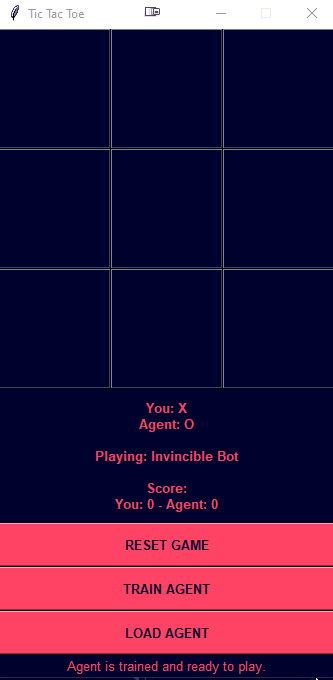
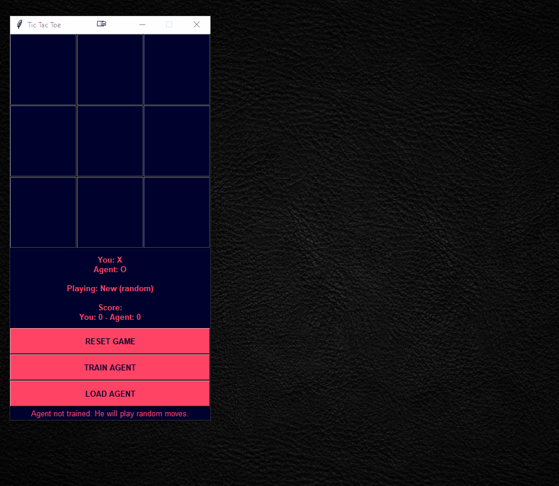

# 🤖 TicTacToe agent based on Reinforcement leaning

This project was made as a part of the _Intelligent Systems_ course at _Faculty of Organization and Informatics_. 

## 🥅 Project goals

Goal of this project was simple - to make an **agent** learn to play the **Tic-tac-toe** game!

And to showcase it with a slick `tkinter` GUI!

&nbsp;




&nbsp;

 ## ⚒️ Features

- [x] Train Reinforcement learning Tic-Tac-Toe agents.
- [x] Set training parameters (number of iterations and learning strategy).
- [x] Save/Load trained agents.
- [x] Keep game score.
- [x] Switch players each game.
- [x] No dependencies.

&nbsp;

---

## Install

1. Clone the repo or download ZIP
   
   ```bash
   $ git clone https://github.com/marzekan/tictactoe-rl-agent.git
   ```

2. Run `main.py`

    ```bash
    $ cd tictactoe-rl-agent

    $ python3 main.py
    ```

&nbsp;

---

## 📜 Docs

This next sections is supposed to be a _quick-n-easy-straight-to-the-point_ documentation.

Documentation begins with a demo and a step-by-step explanation of it.

### _Train-Save-Load-Play_ Demo

Following demo shows:

- Training the agent
- Saving trained agent
- Loading trained agent
- Playing loaded agent



Next submodules contain step-by-step explanations of actions performed in the gif above.

#### Training the agent

- Click `TRAIN AGENT` button that opens _Agent training window_.
- Select '**_Q Agent vs. Q Agent_**' from the _Pick agent strategy_ dropdown.
- Enter `20000` as number of training iterations in _Num. iter_ textbox.
- Click the green `Train!` button.
  
- This will begin agent training and when that is done, the _File explorer window_ will open.

#### Saving trained agent

- When agent training finishes _File explorer window_ will open.
  
- Name file: `'Another Bot'` and click `Save`.

#### Loading trained agent

- After saving, the app tells you that agent is trained and that you need to load it to play.
- Press `LOAD AGENT` to load the trained agent.
- This will open _File explorer window_ where you can choose the agent 'save folder'.
- Select `'Another Bot'` folder and press `Select Folder`.

- After loading, the app will instruct you to restart the game to play the loaded agent.

#### Playing loaded agent

 - Press `RESET GAME` and play the trained agent. 

---

### Game rules

This chapter explains the rules of engagement.

- You always play first (as `'X'`) when new game is started.
- When starting the game, opposing agent **IS NOT** trained, you need to **load the trained agent from a file** to play him.
- EACH game you and agent switch signs.
- Whoever plays as `'X'` - plays first.
- You need to get **three** of your **signs in a row** (column, row, diagonal) to win a single game.
  
#### Scoring

- Score is kept.
- You gain 1 point if you win, agent also gains 1 point if he wins.
- Nobody gets a point when game is a 'draw'.
- Score is kept only while the app runs. Scores **ARE NOT** saved.
  
### Agent training

Agents are trained in the **Agent training window** that is accessed via `TRAIN AGENT` button.

There are 2 hyperparameters you can tune for agent training:
  - Learning strategy: **Q-Learning** or **random**.
  - Number of training iterations.

#### Learning strategies

Main learning strategy is of course now famous **Q-Learning**. When this strategy is selected the agent will play against itself for the given number of iterations. While training, it will fill up its Q-table with score values for each move. This table will later be used for determining the best move to play against you.

While training, one instance of Q-Learning agent always plays with `'O'` and other with `'X'`. In other words, when the training is done there are 2 agent, each learned to play with as a different sign. This way, we can save both of theirs Q-tables' as features of a SINGLE agent that knows how to play both as `'O'` and `'X'`.

Second possible strategy is agent making filling its Q-table by just making random moves and trying to learn that way.

#### Training iterations

Number of iterations represents the number of games the agent will plays against itself before playing you. As in other reinforcement learning bots, the meat of it's knowledge comes from the large number of played games.

We found that agent trained with Q-Learning strategy for 200.000 iterations is quite hard to beat. Feel free to train them even longer, there is no limit ;)

### Saving agents

- You can save the agents _save folder_ anywhere on your disk.
- As mentioned, by saving trained agent you really just save his **_Q-table_** values for `'x'` and `'O'` moves.
- After saving, if you look in the save directory you will those 2 files, one staring with `trained_O_<name of save folder>` and `trained_X_<name of save folder>`. These contain the Q-tables.
- Files are saved as `pickle` files - `.pkl`
  
- If you don't provide a name for your _save folder_ the app will give it the DEFAULT name. The default is a directory named `save_<datetime>`.


### Loading agents

- When loading an agent, you **need to select the save FOLDER** containing saved agent files, not save files themselves.
- After loading you need to press the `RESET GAME` button to continue playing the loaded agent.

---

## 🔗 Credits

This project was greatly inspired by the following sources:

[[1] How to use reinforcement learning to play tic-tac-toe](https://towardsdatascience.com/how-to-play-tic-tac-toe-using-reinforcement-learning-9604130e56f6) by Rickard Karlsson

[[2] Reinforcement Learning Tic Tac Toe Python Implementation](https://programmerbackpack.com/reinforcement-learning-tic-tac-toe-python-implementation/) by Marius Borcan

Thank you for doing great work!
